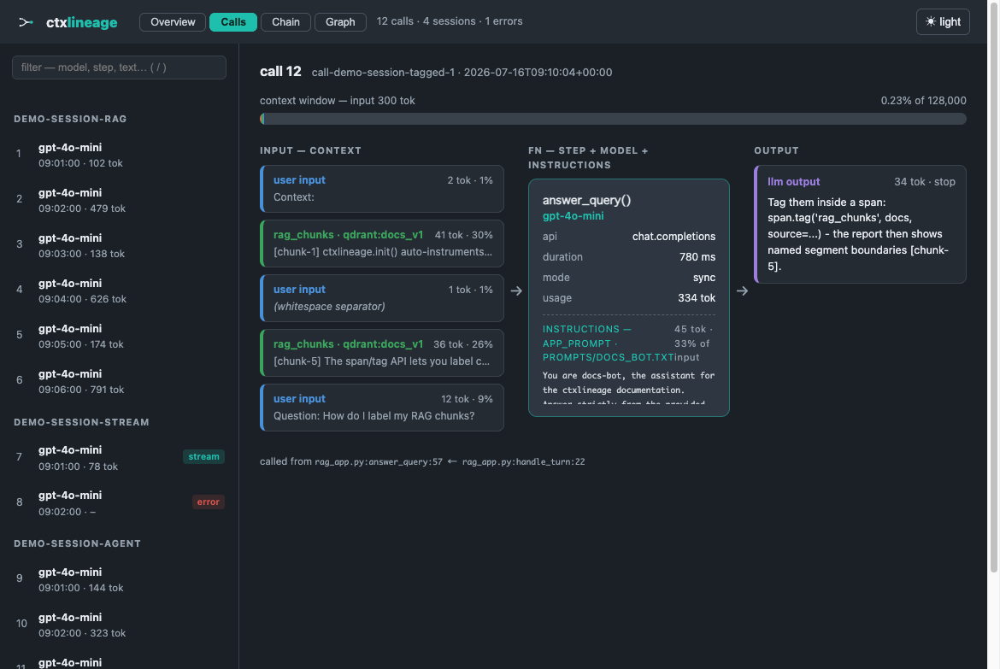
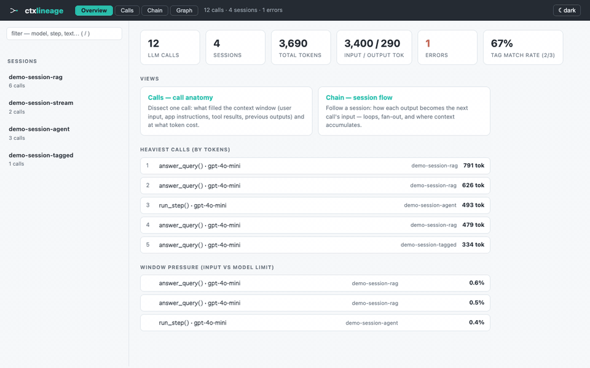

<div align="center">

<picture>
  <source media="(prefers-color-scheme: dark)" srcset="assets/logo-dark.svg">
  
</picture>

# ctxlineage

### See exactly what context each LLM call consumed — and how it flowed into the next.

Two lines of code turn your app's LLM calls into a single static HTML report:
the anatomy of every context window, and the lineage of every context element.
**No server, no database, no account. Your prompts never leave your machine.**

Not another trace viewer: ctxlineage makes your runtime context an **engineered
artifact** — decomposed, provenance-tracked, and *(v0.2)* testable in CI.

[](https://github.com/ctxlineage/ctxlineage/actions/workflows/test.yml)
[](https://codecov.io/gh/ctxlineage/ctxlineage)
[](https://pypi.org/project/ctxlineage/)
[](pyproject.toml)
[](LICENSE)

</div>

<p align="center">
  
</p>

## Quickstart

```bash
pip install ctxlineage
```

```python
import ctxlineage
ctxlineage.init()  # auto-instruments the openai and anthropic SDKs
# ... run your app: every LLM call is recorded to .ctxlineage/events.jsonl
```

```bash
ctxlineage report --open   # one self-contained HTML file
```

That's the whole integration. Streaming, async, tool calls — captured.
Add `.ctxlineage/` to your `.gitignore`.

## What you get

| View | Question it answers |
|---|---|
| **Overview** | Which calls are heaviest? How close to the window limit? Did my tags match? |
| **Calls** | What *actually* filled this call's context window — and at what token cost? |
| **Chain** | How did each output become the next call's input? Where do agent loops accumulate context? |
| **Graph** | Where did each context element *come from* (vector DB, prompt file, memory) and which downstream calls did it influence? |

Think **`dbt docs generate`, for your context windows**: calls are functions,
context elements are typed inputs with provenance, outputs flow into
downstream inputs.

<p align="center">
  
</p>

## Tagging (optional, unlocks lineage)

Everything above works with zero tagging. Label your context assembly and the
report upgrades from role-based heuristics to real, provenance-carrying
segments:

```python
with ctxlineage.span("answer_user_query") as span:
    span.tag("rag_chunks", docs, source="qdrant:products_v2", transform="top_k(8)")
    span.tag("memory", user_profile, source="memory:user_prefs")
    resp = client.chat.completions.create(...)
```

Tagged content is matched back into the actual prompts (exact → partial →
honestly-untagged, with the match rate displayed — never fabricated).

## Testing context in CI (`ctxlineage test`)

The same recorded artifact is a substrate for **deterministic assertions** — no
LLM judge, no eval dataset. Write a `ctxlineage.toml`:

```toml
[[assert.window_budget]]
max_pct = 80                 # no call may exceed 80% of the model's window

[[assert.window_budget]]
segment = "tool_defs"        # a segment kind, or a tag name
max_pct = 20                 # tool definitions may not eat >20% of the window

[[assert.grounded]]
tag = "rag_chunks"           # every rag_chunks tag must land in the window
warn_dead = true             # advisory: flag chunks nothing downstream consumed
```

```bash
ctxlineage test              # exits non-zero on a hard-gate failure → CI gate
```

**A rule only gates where its evidence is exact**, which decides what can fail
your build:

| | Gates on | Because |
| --- | --- | --- |
| `window_budget` | any call, **no tagging needed** | token counts and the model window are deterministic from capture alone |
| `grounded` presence | tagged content only | the `tag()` is your declaration, so "it never reached the window" is exact |
| `grounded` dead-context | nothing — **advisory** | "nothing downstream used it" is read off *inferred* lineage edges |

Gating on inference is how you get a flaky gate, so ctxlineage won't do it: an
untagged run warns instead of failing, and anything that couldn't be evaluated
(an unknown model window, a segment name that never appeared) is reported as
skipped or warned — never silently passed.

`segment` selects on the kinds the pipeline really produces — `system`, `user`,
`assistant`, `tool`, `tool_defs` — or any tag name.

### Try it in 30 seconds (no API key)

```bash
python examples/rag_app.py --mock            # records a real run, fully offline
ctxlineage test -c examples/ctxlineage.toml  # → All 3 assertion(s) over 3 call(s) passed
```

[`examples/ctxlineage.toml`](examples/ctxlineage.toml) is a commented reference
config; CI runs exactly the two commands above, so it cannot drift from the code.

### Wiring it into CI

`ctxlineage test` gates a **recorded run**, so CI needs one. It does not have to
be a live one — assertions read the JSONL, not the network:

```yaml
# .github/workflows/context.yml
- run: pip install ctxlineage
- run: pytest tests/            # your existing suite, with ctxlineage.init() in it
- run: ctxlineage test          # fails the build on a hard-gate breach
```

Where the events come from is your choice, and the trade is real:

| | Deterministic? | Cost |
| --- | --- | --- |
| Your existing tests, with mocked/replayed responses | yes — **start here** | none |
| A live run against the real API | no (temperature, model drift) | tokens |
| `ctxlineage import --from claude-code` | yes (a recorded session) | none |

Prompt *assembly* is usually deterministic even when the model's replies are
not — which is the point: a mocked run still proves what your code put in the
window. The examples take this route (`--mock` replays canned responses), and
so can your test suite. Live runs need a statistical gate (run N times, assert a
pass rate) rather than a single hard gate — that is not built yet, so keep hard
gates on recorded runs.

## Importing coding-agent sessions (`ctxlineage import`)

Claude Code and `claude -p` are separate, non-Python processes, so
`ctxlineage.init()` can't patch them. But they already write a session
transcript to disk — so ctxlineage reads that local file. Nothing is proxied,
injected, or sent anywhere; it is the same local-first bargain as capture.

```bash
ctxlineage import --from claude-code       # newest session for this directory
ctxlineage import --from claude-code --session <id>
ctxlineage import --from claude-code path/to/session.jsonl
ctxlineage import --from claude-code --dry-run   # show what it would do, write nothing
ctxlineage report --open                   # renders like any captured session
```

The transcript becomes ordinary `events.jsonl`, so the four views, `ctxlineage
test`, and the MCP server all work on it unchanged.

**What a transcript cannot tell you.** This is reconstruction, not capture, and
the gaps are real — the report is honest about them rather than inventing
numbers:

| | |
| --- | --- |
| Token counts | **The API's own** `usage`, reconstructed from the transcript — not estimated |
| Segment sizes | **Estimated** (the prompt text is rebuilt from the conversation tree) |
| System prompt, tool definitions | **Not preserved** — they were sent and cost tokens, but the transcript never records them |
| Reasoning text | **Not preserved** — kept as a signature with the text stripped |
| Request params, duration, stream flag | **Not preserved** |

So an imported call's segments account for only part of its real prompt: the
system prompt and tool definitions alone can be tens of thousands of tokens.
`ctxlineage import` prints the coverage it achieved, and the unaccounted
remainder is recorded per call. Live capture via `ctxlineage.init()` remains the
complete picture; import is the bridge to processes you cannot patch.

## Principles

- **Local-first, zero-server.** The artifact is one HTML file that opens
  offline. Capture is an append-only local JSONL. Nothing is ever transmitted.
- **Non-intrusive by default.** `init()` and you're done; tags are progressive
  enhancement. The capture layer never breaks your app — failures degrade to
  warnings, not exceptions.
- **Honest data.** Real `usage` counts preferred over estimates, estimates
  labeled, unmatched tags shown as unmatched, inference caps disclosed.

## Scope & limits

Designed as a **per-run, dev-time artifact**. Comfortable up to ~5,000 calls
(~15 MB report); usable to ~20,000 calls (~65 MB). Reports contain full prompt
text — treat them like logs with sensitive data (see [SECURITY.md](SECURITY.md)).
Before sharing, mask secrets with `ctxlineage report --redact "sk-[A-Za-z0-9]+"`
(repeatable regex; the report discloses what was redacted), or keep them out of
the log entirely with `ctxlineage.init(redact_fields=["request.messages.content"])`.

## Status

**v0.1.0** — first public release: the capture layer (openai + anthropic), the
four-view report, the span/tag lineage pipeline, the read-only MCP server, and
runnable examples are all in.

**Unreleased (v0.2 in progress):** `ctxlineage test` — context you can gate in
CI — and `ctxlineage import --from claude-code` are both on `main` but **not yet
released**; `pip install ctxlineage` still gives you v0.1.0. See the
[CHANGELOG](CHANGELOG.md) and the
[issues](https://github.com/ctxlineage/ctxlineage/issues).

## Contributing

See [CONTRIBUTING.md](CONTRIBUTING.md) — DCO sign-off, hermetic tests,
deliberately small maintenance surface ([off-roadmap issues may be closed](docs/PLAN.md)).

## License

[Apache-2.0](LICENSE)
